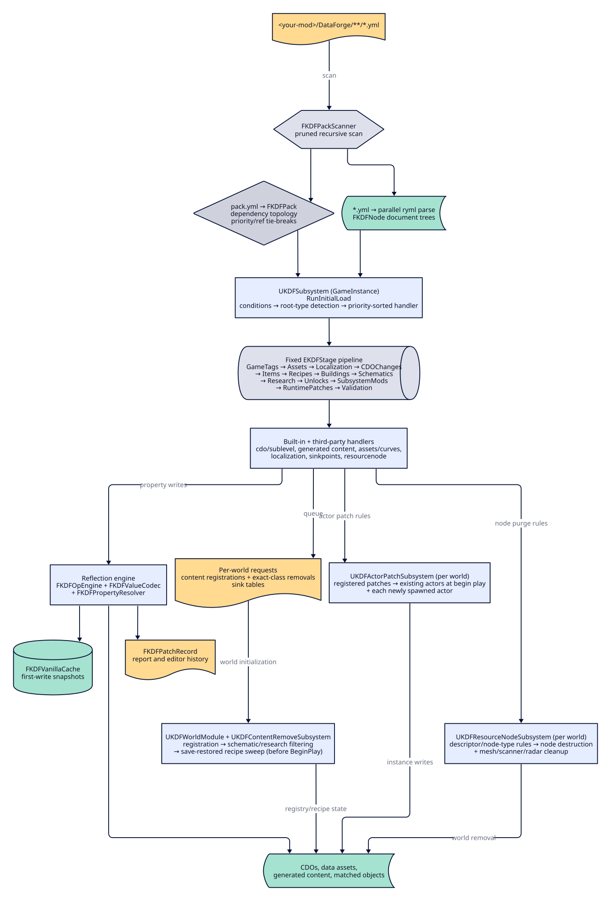

## Overview

KDataForge is a **data-driven runtime content editing framework**. Users, and other mods, describe
changes to game content in YAML documents. The framework parses these documents once at startup,
validates them, and applies them through Unreal's reflection system in a fixed, deterministic
stage order.

Authors use `<your-mod>/DataForge/**/*.yml`. The scanner itself starts at the Unreal project root,
which is `FactoryGame/` in a packaged game. It recognizes directories named `DataForge`, the legacy
name `data-editor`, and any directory containing `pack.yml`. Roots may nest, and each YAML file is
assigned only to its deepest enclosing root. An implicit pack ref and name come from the detected
root's parent directory, so an explicit stable `ref` is recommended.

## Lifecycle Integration (SML)

KDataForge hooks SML's module lifecycle via two auto-discovered root modules, `UKDFGameInstanceModule`
and `UKDFWorldModule`.

`UKDFGameInstanceModule` acts across three phases. During CONSTRUCTION, its built-in handlers exist
(the subsystem's `Initialize`), and this is the window in which third-party mods register their own
handlers. During INITIALIZATION, `UKDFSubsystem::RunInitialLoad()` performs the full scan, parse,
and apply pass. This runs before any world or save loads, so CDO edits and generated classes exist
before anything references them. The full pass runs only once per GameInstance. During
POST_INITIALIZATION, the load report is logged.

`UKDFWorldModule` runs per world. It registers the `/kdf` chat command. During world
INITIALIZATION, after save deserialization and before actor `BeginPlay`, it drains queued content
registration, applies schematic/research registry removals, then asks `UKDFContentRemoveSubsystem`
to sweep save-restored recipes. Registration runs first, so an explicit removal wins when both name
the same class.

SML guarantees all modules receive CONSTRUCTION before any receives INITIALIZATION, which makes the
third-party handler registration window safe.

## Core Components

| Component                 | Type                    | Responsibility                                                                                          |
| ---------------------------- | -------------------------- | ------------------------------------------------------------------------------------------------------------ |
| `UKDFSubsystem`           | GameInstanceSubsystem   | Owns loader, handler registry, class/object caches, patch records, registrations, removals, and world rules |
| `FKDFPackScanner`         | static                  | Filesystem discovery (pruned recursive walk, `pack.yml` manifests)                                      |
| `FKDFYamlParser`          | static (KDataForgeYaml) | ryml façade, the only YAML entry point; thread-safe parse, deterministic hand-written emitter           |
| `FKDFConditionEvaluator`  | static                  | Document `conditions:` evaluation                                                                       |
| `FKDFPropertyResolver`    | static                  | Property path → (FProperty, value ptr) resolution incl. containers and object dereference               |
| `FKDFValueCodec`          | static                  | Bidirectional YAML ↔ FProperty conversion                                                               |
| `FKDFOpEngine`            | static                  | The 22 property operations with per-kind capability matrix                                              |
| `FKDFVanillaCache`        | member of subsystem     | First-write snapshots for editor diff, undo, and changes-only export                                    |
| `FKDFDynamicContentRegistry` | member of subsystem  | Creates deterministic generated classes/assets and reconstructs missing generated classes as tombstones |
| `UKDFCdoHandler`          | handler (`cdo`)         | CDOs, data-asset instances, `allAssetsOfClass`, tag matcher, actor patches                               |
| `UKDFSublevelHandler`     | handler (`sublevel`)    | Blocks RefinedRDLib/KBFL sublevel descriptor assets during `CDOChanges`                                 |
| `UKDFContentClassHandler` | handler base            | Generates item/resource/building/unlock/recipe/schematic/research classes; queues registration/removal  |
| `UKDFAssetHandler`        | handler (`asset`)       | Decodes pack-relative 2D images into transient texture assets                                            |
| `UKDFDataAssetHandler`    | handler (`dataasset`)   | Creates `UDataAsset` instances, applies instanced lists, and requests optional consumer rescans          |
| `UKDFCurveHandler`        | handler (`curve`)       | Creates or edits `UCurveFloat` and `UCurveVector` assets during the Assets stage                         |
| `UKDFGameTagHandler`      | handler (`gametag`)     | Runtime gameplay tag registration                                                                        |
| `UKDFLocalizationHandler` | handler (`localization`)| Runtime namespace/culture text registration                                                               |
| `UKDFSinkPointsHandler`   | handler (`sinkpoints`)  | Queues per-world AWESOME Sink table values                                                                |
| `UKDFResourceNodeHandler` | handler (`resourcenode`)| Registers descriptor/node-type purge rules for live worlds                                               |
| `UKDFActorPatchSubsystem` | WorldSubsystem          | Applies actor patches at world begin play + every spawn                                                  |
| `UKDFContentRemoveSubsystem` | WorldSubsystem       | Orchestrates recipe sweeps and exposes per-world removal queries/counts                                  |
| `UKDFResourceNodeSubsystem` | WorldSubsystem        | Purges matching nodes, local mesh actors, scanner data, and radar/scanner caches                         |
| `FKDFRecipeRemoval`       | static/native hooks     | Blocks future recipe adds and removes recipes restored from server save data                             |
| `AKDFChatCommand`         | chat command             | `/kdf report`, `/kdf editor`, `/kdf debug on\|off`                                                       |

## The Reflection Engine

**Resolution** (`FKDFPropertyPath` → `FKDFPropertyResolver`) turns a parsed path such as
`mIngredients[0].Amount` into a value, segment by segment, supporting name lookup (including
Blueprint authored names), array/set index access, and map key lookup. Dereferencing through
object-typed members is also supported, which is what makes `mSomeComponent.Property` and default
subobjects reachable.

**Conversion** (`FKDFValueCodec`) supports bool, all numerics, enums (typed and byte-based),
FString/FName/FText (with localized `key`, `ns`, and `source` fields), object/class references (hard
and soft), structs (native text form, map form, positional sequence form), arrays, sets, and maps,
with everything else falling back to a generic text-based conversion path. This fallback is what
makes "every reflectable type" honest, without needing hundreds of hand-written cases.

**Operations** (`FKDFOpEngine`) validate each op against the leaf property kind before applying it:
`multiply` on an FString produces a diagnostic, not a silent no-op. `FGameplayTagContainer` is
special-cased so tag containers accept append/prepend/remove/clear/set with plain tag names. The full list
of the 22 supported operations, their signatures, and which property kinds accept each one is
covered in [Operations](/kdataforge/features/operations). The property kinds
themselves, and how a `mIngredients[0].Amount`-style path resolves, are covered in
[Property Types](/kdataforge/features/property-types).

## Vanilla Snapshots

Before the **first** write to any `(object, property path)` pair, the original value is exported to
canonical text and stored in `FKDFVanillaCache`. The in-game editor uses this snapshot for its Diff
tab, undo workflow, and changes-only export.

## Runtime Actor Patches

`applyToSpawnedActors: true` on a cdo patch registers an `FKDFActorPatch`. `UKDFActorPatchSubsystem`
applies the ops to all matching pre-existing actors at world begin play, and to every matching
actor the moment it spawns. This guarantees YAML values win even where per-instance state, such as
save-restored values or archetypes, would override plain CDO defaults. Exact-class or subclass
matching is controlled by `applyToSubclasses`.

Actor-instance operations are direct writes. They do not compare against vanilla snapshots and do
not preserve player-modified or save-restored values. The same class-scoped operation list is
applied to every matching instance.

The `cdo` document type, its `properties:`/`applyToSpawnedActors`/`applyToSubclasses` fields, and
the CDO/data-asset/tag-matcher targeting model are covered in full in
[Patching (type: cdo)](/kdataforge/features/patching-cdo) and
[Targeting](/kdataforge/features/targeting).

## Per-world Registration and Removal

GameInstance handlers cannot mutate world managers because no gameplay world exists during the
initial YAML pass. They retain deterministic requests instead:

- recipe, schematic, and research entries queue SML content registration;
- document-level `remove:` on those same types queues exact-class removal rules;
- `sinkpoints` queues Sink table writes;
- `resourcenode` queues descriptor/node-type purge rules;
- `cdo` with `applyToSpawnedActors` queues actor-class patch rules.

`UKDFWorldModule` drains registrations before removals during world INITIALIZATION. SML directly
removes schematic and research classes. Recipes need `FKDFRecipeRemoval`: process-wide hooks block
future singular and batch adds, while the per-world sweep removes recipes already restored from the
server save before `AFGRecipeManager::BeginPlay` builds derived caches. Resource Node purges use a
separate four-point schedule because level actors, streamed levels, spawns, and late descriptor
retargeting become visible at different times.

## Savegame Persistence Strategy

Dynamically created content must survive save/load with valid class paths.

Class generation relies on SML's `FClassGenerator::GenerateSimpleClass` (root-set, parent layout
copy, CDO auto-created). Class identity is **id-based and deterministic**: package
`/KDataForge/Gen/<PackRef>`, class `Gen_<PackRef>_<Id>`. It is never derived from file paths or
load order, so renaming a file must not orphan save data.

Classes survive save and load because they are created during GameInstance INITIALIZATION,
strictly before any save loads. The save serialiser resolves class paths through
`StaticFindObject` before attempting a linker load, so resolution hits the in-memory class. No
cooked package is needed.

The constraint is that generated classes keep the parent's layout: no new reflected properties and
no new components. All variation lives in CDO defaults. This covers descriptors, recipes,
schematics, and unlocks fully, but it does **not** cover new buildables with custom components.

A global generated-content manifest at `Saved/KDataForge/GeneratedClasses.json` records **every
generated class ever created**, including its pack, id, and parent path. At startup, recorded
classes missing from the current YAML are recreated as **tombstones**: functional but hidden and
deprecated, so old saves load cleanly even after packs are removed. Because the manifest is
global, class-path resolution works for **any** save, not just ones whose header was written by
KDataForge.

Renames use `redirects:` in `pack.yml` (`OldId: NewId`), which feeds `FCoreRedirects` so old save
class paths resolve to the renamed class.

Per-save state is held by `AKDFStateSubsystem : AModSubsystem` with SaveGame properties that store
the applied-pack history: pack ref, version, and timestamp per entry.

Removal features have separate persistence rules:

- schematic and research-tree registry removals write nothing to the save and reverse next session
  after the pack is removed, but do not revoke purchases or research progress;
- recipe removal mutates the saved available-recipe list, then self-heals on a later load without
  the pack when purchased schematics reapply unlocks;
- `resourcenode` destroys world actors, and vanilla can persist those destruction tombstones even
  after the pack is removed. It is a potentially irreversible world migration.

See [Recipes](/kdataforge/features/recipes#removing-recipes),
[Schematics](/kdataforge/features/schematics#removing-schematics),
[Research Trees](/kdataforge/features/research-trees#removing-research-trees), and
[Resources](/kdataforge/features/resources#removing-resource-nodes-type-resourcenode) before using
those paths.

See [Recipes](/kdataforge/features/recipes),
[Schematics](/kdataforge/features/schematics), and
[Unlocks](/kdataforge/features/unlocks) for the document types that drive this
generated-class path, and [Renaming Content Safely](/kdataforge/tutorials/renaming-content-safely)
for how `redirects:` is used in practice.

## Multiplayer Boundaries

Every game process performs its own initial YAML load. The current source has no pack-checksum
handshake, mismatch rejection, or server-to-client operation stream. Install the same packs and
versions on the server and every client.

`UKDFRemoteCallObject::Server_ApplySetOp` is a host-gated RPC scaffold. The editor UI does not call
it, and there is no general `Server_ApplyOps` pipeline. Treat live editor changes as local process
state, not synchronized multiplayer state.

## Determinism Rules (load-bearing)

1. Stages execute in fixed `EKDFStage` enum order.
2. Pack dependencies are hard topological constraints. Packs with missing, self-referential, or
   transitively invalid dependencies are rejected. Dependency cycles are rejected. Among packs
   whose dependencies are ready, higher priority runs first and `ref` ascending breaks ties.
3. Within a stage, handlers are ordered by priority descending then root type ascending. Documents
   follow their dependency-ordered packs, then same-stage `include:` constraints and relative path.
4. Map iteration never determines apply order. `FKDFNode` maps preserve document order.
5. Every process must see the same pack set and inputs to produce the same result. KDataForge does
   not verify this across multiplayer peers yet.

For the module layout that hosts these subsystems and handlers, see
[Module Structure](/kdataforge/background/module-structure). For the YAML fields that
condition evaluation, targeting, and the stage/handler pipeline actually parse, see the
[YAML Schema](/kdataforge/reference/yaml-schema) reference.
