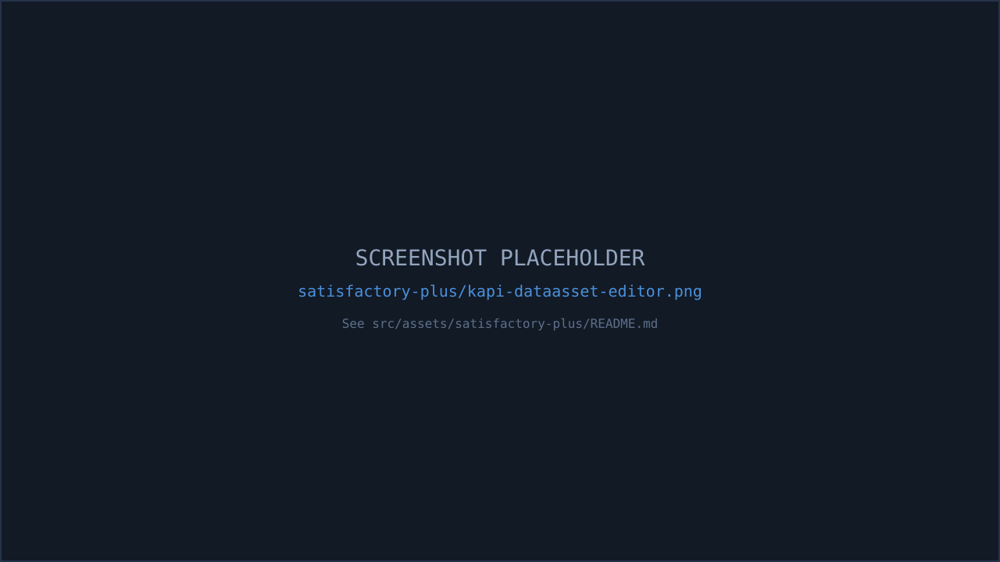

Satisfactory Plus declares **KAPI as a mandatory, compiled dependency** and uses it to create its own game content as DataAssets that any other KAPI-aware mod or tool (including [KDataForge](/satisfactory-plus/kdataforge/)) can then discover and read.

## Why a hard dependency here

KAPI is the shared data-driven API library that powers KMods machines: it exposes a base class and a scanning subsystem so mods can register configuration (new miners, cleaners, air collectors, ...) as plain Unreal `DataAssets` instead of hand-rolling bespoke C++/Blueprint plumbing per mod. SF+ ships its own content through this system, so it links against KAPI directly rather than trying to duplicate that machinery.

## The dependency, in the plugin manifest

`SatisfactoryPlus.uplugin` declares KAPI as a required (non-optional) plugin:

```json
{
  "Name": "KAPI",
  "SemVersion": ">=9999.9.9",
  "bIsOptional": false,
  "bIsBasePlugin": false,
  "Enabled": true
}
```

And `SatisfactoryPlus.Build.cs` lists `KAPI` in `PublicDependencyModuleNames`, alongside `FactoryGame`, `SML`, and `KBFL` — a real, compiled/linked C++ module dependency, not a reflection-based lookup.

## The pattern: subclass `UKAPIDataAssetBase`

KAPI provides `UKAPIDataAssetBase` — a `UPrimaryDataAsset` implementing `IGameplayTagAssetInterface`, with common fields every KAPI-driven asset shares (`mName`, `mDescription`, `mIcon`, `mIsDisabled`, `mPriority`, `mTags`).

SF+ subclasses it directly in C++:

```cpp
class SATISFACTORYPLUS_API USFPContentDescriptor : public UKAPIDataAssetBase
{
    // ...
};
```

A real instance of this class ships as a content asset in the mod: `SatisfactoryPlus/Content/AssetDatas/Modules/PDA_ContentDescriptor.uasset`.

:::tip
You don't strictly need C++ to do this yourself. KAPI's own documentation notes that third-party mods can extend KMods behavior by creating their own DataAssets that inherit from `UKAPIDataAssetBase` **purely in the Unreal Editor / Blueprint**, without touching C++ at all — subclassing in C++ (as SF+ does) is the more involved option, useful when you also need custom logic alongside the data.
:::

## How the game finds these assets

KAPI's `UKAPIDataAssetSubsystem` (a `UGameInstanceSubsystem`) scans the **Unreal Asset Registry** at startup for every registered instance of a `UKAPIDataAssetBase` subclass, sorts them by `mPriority`, and exposes typed lookups such as `Miner_GetAllAssets()` or `Cleaner_GetForKey(...)`.

SF+ calls into this subsystem directly wherever it needs to check what's been registered, e.g.:

```cpp
UKAPIDataAssetSubsystem::GetChecked(this)->mAllowedResourceExtractors.Contains(...)
```

Because discovery happens through the Asset Registry scan rather than a hardcoded list, any KAPI-aware mod's DataAssets — SF+'s own, or a third party's — show up the same way, without SF+ needing to know about them in advance.

## Summary

| | |
|---|---|
| Dependency type | Hard (compiled `.uplugin` + `.Build.cs` link) |
| What it's used for | Creating SF+'s own DataAsset-driven content |
| Base class | `UKAPIDataAssetBase` (`UPrimaryDataAsset` + `IGameplayTagAssetInterface`) |
| Discovery mechanism | `UKAPIDataAssetSubsystem` scans the Unreal Asset Registry at startup |
| No-C++ alternative | Create a `UKAPIDataAssetBase` subclass instance directly in the editor/Blueprint |


