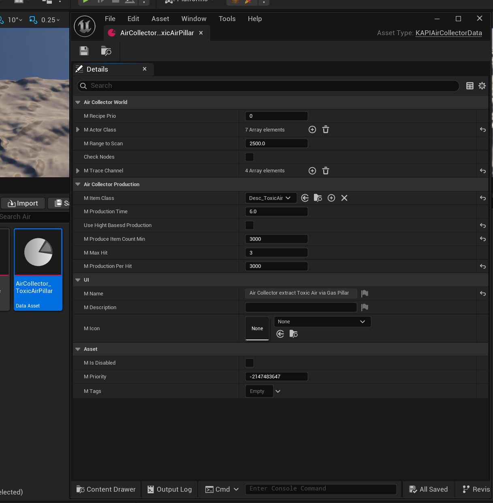

## The DataAsset

For adding new Resources to the Air Collector in Satisfactory Plus, you need to create a new DataAsset of type `KAPIAirCollectorData` the header can be found [HERE](https://github.com/Satisfactory-KMods/public-source/blob/main/KAPI/Source/KAPI/Public/DataAssets/KAPIAirCollectorData.h).

## Properties

| Property                    | Type                                          | Description                                                                                             |
| ---------------------------- | ---------------------------------------------- | --------------------------------------------------------------------------------------------------------- |
| `mRecipePrio`                | `int32`                                        | The priority of this DataAsset's recipe.                                                                 |
| `mActorClass`                | `TArray<TSubclassOf<AActor>>`                  | The actor classes the Air Collector scans/hits for in the world.                                         |
| `mRangeToScan`                | `float`                                        | The range around the Air Collector to scan for matching actors. Defaults to `2500.0`.                    |
| `bCheckNodes`                 | `bool`                                         | Whether resource nodes are also checked. Defaults to `false`.                                            |
| `mTraceChannel`               | `TArray<TEnumAsByte<EObjectTypeQuery>>`        | The object trace channels used for the scan query. Defaults to `ObjectTypeQuery1` and `ObjectTypeQuery2`. |
| `mItemClass`                  | `TSubclassOf<UFGItemDescriptor>`               | The item produced by the Air Collector for this Resource.                                                |
| `mProductionTime`             | `float`                                        | The production cycle time in seconds. Defaults to `6.0`.                                                 |
| `bUseHightBasesdProduction`   | `bool`                                         | Selects the production model, see [Notes](#notes). Defaults to `true`.                                   |
| `mProduceItemCountMin`        | `int32`                                        | Minimum produced item count. Only used when `bUseHightBasesdProduction` is `true`. Defaults to `1000`.    |
| `mProduceItemCountMax`        | `int32`                                        | Maximum produced item count. Only used when `bUseHightBasesdProduction` is `true`. Defaults to `25000`.   |
| `mProduceItemCountBase`       | `int32`                                        | Base produced item count. Only used when `bUseHightBasesdProduction` is `true`. Defaults to `5000`.       |
| `mMaxHit`                     | `int32`                                        | Maximum hit count. Only used when `bUseHightBasesdProduction` is `false`. Defaults to `3`.                |
| `mProductionPerHit`           | `int32`                                        | Item count produced per hit. Only used when `bUseHightBasesdProduction` is `false`. Defaults to `2500`.   |

## Notes

- `bUseHightBasesdProduction` gates two mutually exclusive production models:
  - When `true`, `mProduceItemCountMin`, `mProduceItemCountMax` and `mProduceItemCountBase` apply.
  - When `false`, `mMaxHit` and `mProductionPerHit` apply instead.
