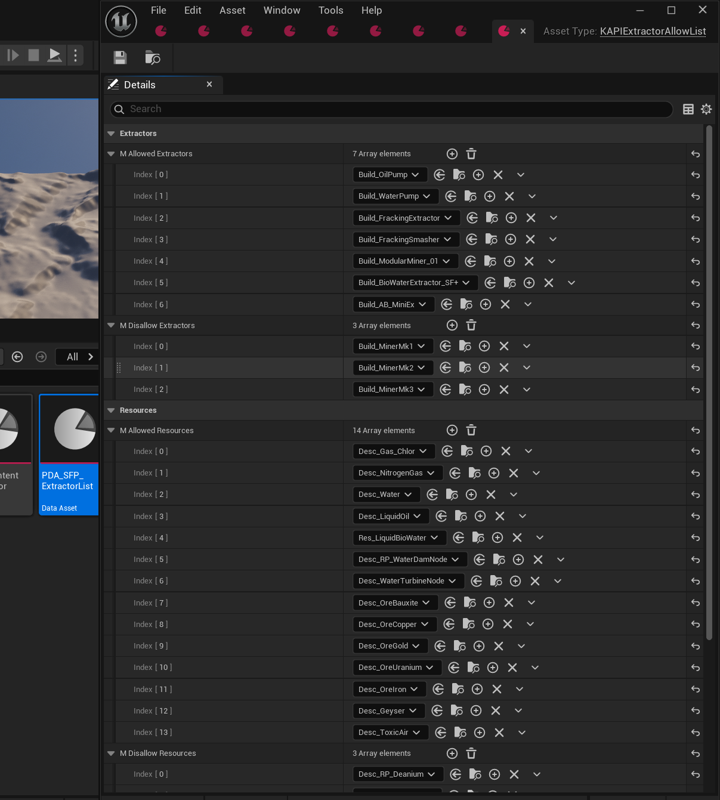

## The DataAsset

For adding Extractors or Remove Extractors to Satisfactory Plus, you need to create a new DataAsset of type `KAPIExtractorAllowList` the header can be found [HERE](https://github.com/Satisfactory-KMods/public-source/blob/main/KAPI/Source/KAPI/Public/DataAssets/KAPIExtractorAllowList.h).

## Properties

| Property              | Type                                                     | Description                                                                                       |
| --------------------- | -------------------------------------------------------- | ------------------------------------------------------------------------------------------------- |
| `mAllowedExtractors`  | `TArray<TSubclassOf<AFGBuildableResourceExtractorBase>>` | The list of extractor classes that are allowed.                                                   |
| `mDisallowExtractors` | `TArray<TSubclassOf<AFGBuildableResourceExtractorBase>>` | The list of extractor classes that are disallowed.                                                |
| `mAllowedResources`   | `TArray<TSubclassOf<UFGResourceDescriptor>>`             | The list of resource classes that are allowed.                                                    |
| `mDisallowResources`  | `TArray<TSubclassOf<UFGResourceDescriptor>>`             | The list of resource classes that are disallowed.                                                 |
| `mPriority`           | `int32`                                                  | Sort rank of this DataAsset. See _How the lists are resolved_ below for what it actually does.    |

### Inherited from `KAPIDataAssetBase`

Every KAPI DataAsset also carries these:

| Property       | Type                     | Description                                                                                  |
| -------------- | ------------------------ | -------------------------------------------------------------------------------------------- |
| `mName`        | `FText`                  | Display name of the asset.                                                                   |
| `mDescription` | `FText`                  | Description of the asset.                                                                    |
| `mIcon`        | `TObjectPtr<UTexture2D>` | Icon of the asset.                                                                           |
| `mIsDisabled`  | `bool`                   | When true the asset is ignored entirely. The `KMods.Disabled` gameplay tag does the same.    |
| `mPriority`    | `int`                    | Rank used to resolve duplicates. Defaults to `-MAX_int32`, i.e. the lowest possible ranking. |
| `mTags`        | `FGameplayTagContainer`  | Gameplay tags of the asset.                                                                  |

## How the lists are resolved

All `KAPIExtractorAllowList` assets in the game are collected, sorted by `mPriority` (highest
first, ties broken by asset path), and then applied one after another. Each asset adds its
`mAllowed*` entries to the running set and removes its `mDisallow*` entries from it.

Because the lists are applied in sequence, **the last asset to touch an entry decides it** — with
the sort above that is the lowest-priority asset. `mPriority` defaults to `-MAX_int32`, so an asset
that never sets it is applied last and wins over one that does.

:::caution
This is the opposite of how `mPriority` resolves duplicates everywhere else in KAPI (miner and
filtrator assets keep the highest-priority entry and discard the rest). Do not rely on the current
ordering for conflict resolution between mods.
:::

## Notes

- Creating the `UFGResourceDescriptor` subclass itself and placing resource nodes in the world is standard Satisfactory modding, outside KAPI's scope, and not covered here. `mAllowedResources`/`mDisallowResources` only register an already-existing resource class with SF+'s extractors.
