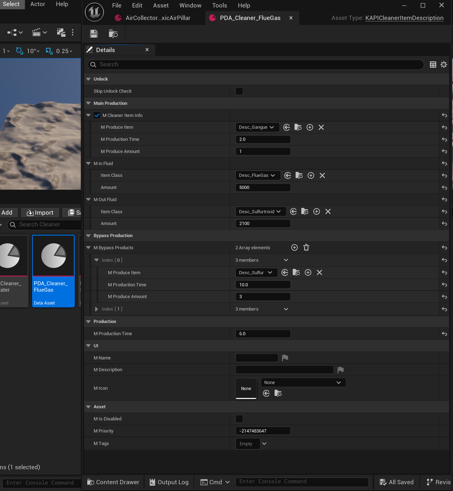

## The DataAsset

For adding new Recipes to the Filtrator (internally named "Cleaner" in KAPI), you need to create a new DataAsset of type `KAPICleanerItemDescription` the header can be found [HERE](https://github.com/Satisfactory-KMods/public-source/blob/main/KAPI/Source/KAPI/Public/DataAssets/KAPICleanerItemDescription.h).

## Properties

| Property           | Type                     | Description                                                                          |
| ------------------- | ------------------------ | ------------------------------------------------------------------------------------- |
| `bSkipUnlockCheck` | `bool`                   | Skip the unlock check for this recipe. The recipe is unlocked by default if `true`.   |
| `mCleanerItemInfo` | `FKAPICleanerInfo`       | The extra item consumed alongside the main recipe, when a cleaner item is needed.     |
| `mBypassProducts`  | `TArray<FKAPICleanerInfo>` | Alternate outputs produced without going through the main fluid recipe.             |
| `mProductionTime`  | `float`                  | The production time of the main recipe, in seconds.                                  |
| `mInFluid`         | `FItemAmount`            | The input fluid item and amount consumed by the main recipe.                         |
| `mOutFluid`        | `FItemAmount`            | The output fluid item and amount produced by the main recipe.                        |

### FKAPICleanerInfo

| Field              | Type                          | Description                                  |
| ------------------- | ------------------------------ | --------------------------------------------- |
| `mProduceItem`     | `TSubclassOf<UFGItemDescriptor>` | The item class produced.                    |
| `mProductionTime`  | `float`                       | The production time for this item, in seconds. |
| `mProduceAmount`   | `int`                         | The amount of the item produced.             |

## Notes

- Whether a cleaner item is required is determined by `CleanerItemNeeded()`. When needed, `mCleanerItemInfo` describes the additional item consumed alongside `mInFluid` to produce `mOutFluid`.
- `mBypassProducts` is a separate list of `FKAPICleanerInfo` entries produced without going through the main `mInFluid` → `mOutFluid` recipe.
