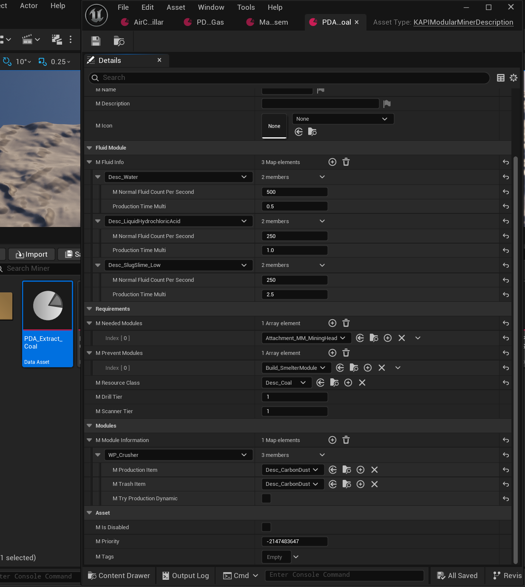

## The DataAsset

For adding new Ore to the Modular Miner in Satisfactory Plus, you need to create a new DataAsset of type `KAPIModularMinerDescription` the header can be found [HERE](https://github.com/Satisfactory-KMods/public-source/blob/main/KAPI/Source/KAPI/Public/DataAssets/KAPIModularMinerDescription.h).



## Properties

| Property                | Type                                                          | Description                                                                                    |
| ------------------------ | -------------------------------------------------------------- | ------------------------------------------------------------------------------------------------ |
| `mRarityText`           | `FText`                                                       | The UI text shown for the rarity of the ore.                                                   |
| `mFoundText`            | `FText`                                                       | The UI text shown when the ore is found.                                                       |
| `mNodeScreenshot`       | `TObjectPtr<UTexture2D>`                                      | The UI screenshot of the ore node.                                                              |
| `mIsFallbackDescriptor` | `bool`                                                        | Marks this entry as the fallback descriptor.                                                   |
| `mFluidInfo`            | `TMap<TSubclassOf<UFGItemDescriptor>, FKAPIMinerInfoFluids>`  | Per-item fluid production settings for fluid modules, see `FKAPIMinerInfoFluids` below.         |
| `mNeededModules`        | `TArray<TSubclassOf<UKAPIModularAttachmentDescriptor>>`       | The attachment modules that must be installed for this ore to be minable.                      |
| `mPreventModules`       | `TArray<TSubclassOf<AFGBuildable>>`                           | The buildable modules that, if installed, prevent this ore from being minable.                 |
| `mModuleInformation`    | `TMap<TSubclassOf<UKAPIWasteProducerType>, FKAPIModuleItems>` | Maps a waste-producer module type to the items it produces for this ore, see `FKAPIModuleItems` below. |
| `mResourceClass`        | `TSubclassOf<UFGResourceDescriptor>`                          | The ore resource this entry applies to.                                                        |
| `mDrillTier`            | `int`                                                         | The minimum drill tier required to mine this ore.                                              |

### Inherited from `KAPIDataAssetBase`

Every KAPI DataAsset also carries these:

| Property       | Type                     | Description                                                                                  |
| -------------- | ------------------------ | -------------------------------------------------------------------------------------------- |
| `mName`        | `FText`                  | Display name of the asset.                                                                   |
| `mDescription` | `FText`                  | Description of the asset.                                                                    |
| `mIcon`        | `TObjectPtr<UTexture2D>` | Icon of the asset.                                                                           |
| `mIsDisabled`  | `bool`                   | When true the asset is ignored entirely. The `KMods.Disabled` gameplay tag does the same.    |
| `mPriority`    | `int`                    | Rank used to resolve duplicates. Defaults to `-MAX_int32`, i.e. the lowest possible ranking. |
| `mTags`        | `FGameplayTagContainer`  | Gameplay tags of the asset.                                                                  |

### FKAPIModuleItems

| Property                | Type                              | Description                                                    |
| ------------------------ | ---------------------------------- | ------------------------------------------------------------------ |
| `mProductionItem`      | `TSubclassOf<UFGItemDescriptor>` | The item produced by this module.                              |
| `mTrashItem`           | `TSubclassOf<UFGItemDescriptor>` | The item produced as waste by this module.                     |

### FKAPIMinerInfoFluids

| Property                     | Type    | Description                                                                                     |
| ---------------------------- | ------- | ----------------------------------------------------------------------------------------------- |
| `mNormalFluidCountPerSecond` | `int`   | Fluid **consumed** per second while the miner runs, in internal units (1000 = 1 m³).            |
| `ProductionTimeMulti`        | `float` | Speed bonus this fluid grants. Added to the production buff, so a higher value mines **faster**. |

The miner buffers the fluid in its input slot and drains
`mNormalFluidCountPerSecond * <node purity multiplier>` every second. If the buffer cannot cover a
cycle the extraction stops until it refills, so the fluid is an input, never an output.

`ProductionTimeMulti` feeds the same buff sum as the module bonuses:

```text
cycle time = 2s / (purity multiplier + ProductionTimeMulti + module bonuses - module maluses)
```

At normal purity and with no other modules that is `2 / (1 + ProductionTimeMulti)` seconds per cycle.

## Required vs. optional fluids

Listing a fluid in `mFluidInfo` only makes it **accepted**. Whether the fluid module is **mandatory**
is decided solely by `mNeededModules`:

| `mNeededModules` contains the fluid attachment | Behaviour                                                                    |
| ---------------------------------------------- | ---------------------------------------------------------------------------- |
| No                                             | The ore mines dry; every fluid in `mFluidInfo` is an optional speed boost.   |
| Yes                                            | The ore cannot be mined at all without a fluid module and one of its fluids. |

`AKLMMBuildableMiner::HasAllNeededModules` enforces this at runtime: the miner refuses to produce
until every entry of `mNeededModules` is attached. The wiki export follows the same rule — a
fluid-gated ore has **no** plain "extract \<ore\>" recipe, only its per-fluid recipes.

In the shipped SF+ data, Coal accepts water as an optional boost, while Sulfur, Time Crystal and
Uranium are fluid-gated.

## Notes

- The drill/mining head attachment belongs in `mNeededModules` for every ore. It is the one entry
  that does not gate the ore, because no ore can be mined without it anyway.
- `mScannerTier` and `FKAPIModuleItems.mTryProductionDynamic` have no usage yet and may be removed in the future.
