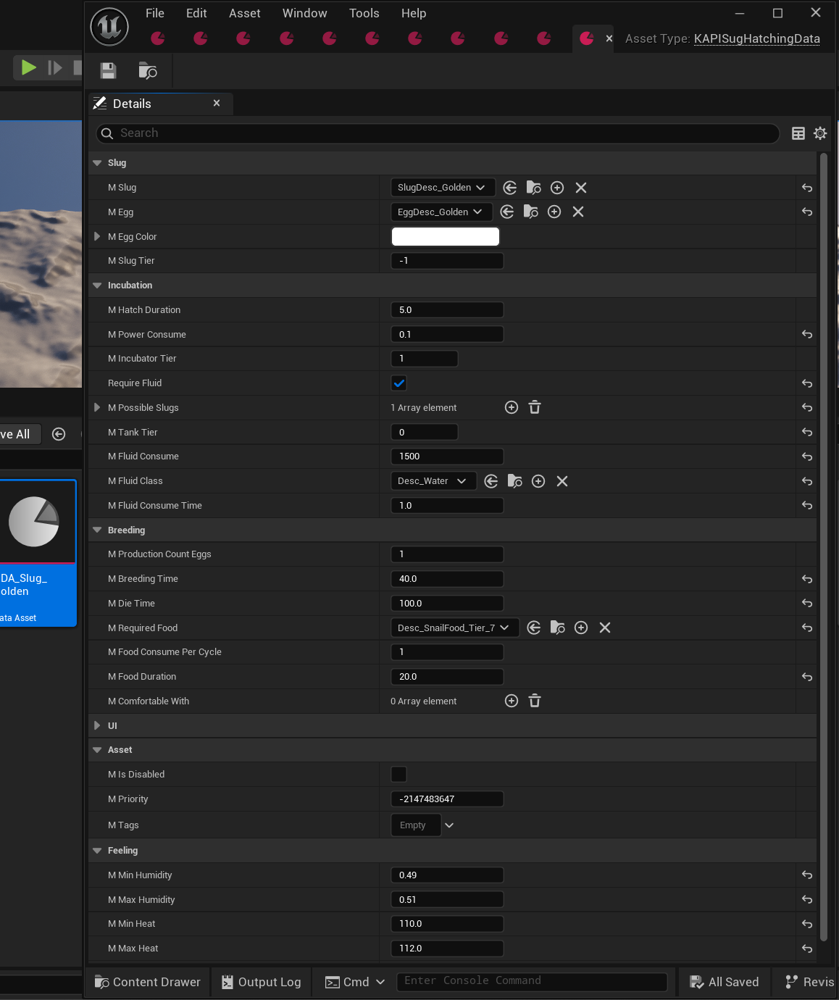

## The DataAsset

For adding new Slug or Breeding Recipes to Satisfactory Plus, you need to create a new DataAsset of type `KAPISugHatchingData` the header can be found [HERE](https://github.com/Satisfactory-KMods/public-source/blob/main/KAPI/Source/KAPI/Public/DataAssets/KAPISugHatchingData.h).

One DataAsset configures a single slug species: its identity, how it's incubated from an egg, and how it breeds.

## Properties

Identifies the slug species and its priority against other slugs.

| Property     | Type                            | Description                                                                                                                     |
| ------------ | -------------------------------- | --------------------------------------------------------------------------------------------------------------------------------- |
| `mSlug`      | `TSubclassOf<UFGItemDescriptor>` | The slug item this DataAsset describes.                                                                                         |
| `mEgg`       | `TSubclassOf<UFGItemDescriptor>` | The egg item this slug hatches from.                                                                                            |
| `mEggColor`  | `FLinearColor`                   | Display color of the egg. Defaults to `FLinearColor::White`.                                                                    |
| `mSlugTier`  | `int32`                          | Priority against other slugs during breeding. Higher tier gets first pick of temp, humidity, day time, and food. Default `-1`. |

Configures the incubator that hatches the egg into a slug.

| Property             | Type                              | Description                                                                                 |
| --------------------- | ---------------------------------- | --------------------------------------------------------------------------------------------- |
| `mHatchDuration`      | `float`                            | Time in seconds to hatch the egg. Default `5.0`.                                            |
| `mPowerConsume`       | `float`                            | Power consumption of the incubator. Default `10.0`.                                         |
| `mIncubatorTier`      | `uint8`                            | Required incubator tier. Default `1`.                                                       |
| `bRequireFluid`       | `bool`                             | Whether the incubator also requires a fluid to hatch. Default `false`.                      |
| `mPossibleSlugs`      | `TArray<FKAPISlugIncubation>`      | The breeding recipe list; see [FKAPISlugIncubation](#fkapislugincubation) below.             |
| `mTankTier`           | `uint8`                            | Required fluid tank tier. Only used if `bRequireFluid` is true. Default `1`.                |
| `mFluidConsume`       | `int32`                            | Fluid amount consumed. Only used if `bRequireFluid` is true. Default `1000`.                |
| `mFluidClass`         | `TSubclassOf<UFGItemDescriptor>`   | The fluid item required. Only used if `bRequireFluid` is true.                              |
| `mFluidConsumeTime`   | `float`                            | Time in seconds between fluid consumption ticks. Only used if `bRequireFluid` is true. Default `2.0`. |

Configures the breeding cycle once the slug is hatched.

| Property                 | Type                                        | Description                                                                 |
| ------------------------- | --------------------------------------------- | ------------------------------------------------------------------------------ |
| `mProductionCountEggs`    | `int`                                        | Number of eggs produced per successful breed. Default `1`.                 |
| `mBreedingTime`           | `float`                                      | Time in seconds a breeding cycle takes.                                    |
| `mDieTime`                | `float`                                      | Time in seconds before the slug dies if left unfed/unbred.                 |
| `mRequiredFood`           | `TSubclassOf<UFGItemDescriptor>`             | The food item required to breed.                                           |
| `mFoodConsumePerCycle`    | `int32`                                      | Amount of food consumed per cycle. Default `1`.                            |
| `mFoodDuration`           | `float`                                      | Time in seconds a single food consumption lasts. Default `2.5`.            |
| `mComfortableWith`        | `TArray<TSubclassOf<UFGItemDescriptor>>`     | Other slug species this slug is comfortable being bred alongside.          |

The slug's own environmental comfort range, checked during breeding.

| Property        | Type            | Description                                                       |
| ---------------- | ---------------- | --------------------------------------------------------------------- |
| `mMinHumidity`   | `float`          | Minimum comfortable humidity. Default `0.2`.                      |
| `mMaxHumidity`   | `float`          | Maximum comfortable humidity. Default `0.8`.                      |
| `mMinHeat`       | `float`          | Minimum comfortable temperature. Default `22.0`.                  |
| `mMaxHeat`       | `float`          | Maximum comfortable temperature. Default `38.0`.                  |
| `mDayTime`       | `EKAPISlugTime`  | Time of day this slug is comfortable breeding. Default `Any`.     |

### FKAPISlugIncubation

One entry in `mPossibleSlugs` is one breeding recipe: which slug can result from incubation, how many, and how likely.

| Property                 | Type                              | Description                                                                                          |
| ------------------------- | ------------------------------------ | -------------------------------------------------------------------------------------------------------- |
| `mSlug`                   | `TSubclassOf<UFGItemDescriptor>`   | The slug produced by this recipe entry.                                                              |
| `mProductionCount`        | `int`                               | Number of slugs produced. Default `1`.                                                               |
| `mProbability`            | `float`                             | Base chance (0.01-100) to breed this slug. Default `100.0`.                                          |
| `mFixedChanceMultiplier`  | `float`                             | Multiplier added to `mProbability` on each failed roll, if `bShouldUseFixedChance` is true. Default `0.1`. |
| `bShouldUseFixedChance`   | `bool`                              | Whether the fixed-chance fallback applies. Default `true`.                                           |

## Notes

- `mSlugTier` decides breeding priority between slug species: the higher the tier, the earlier that slug's temp, humidity, day-time, and food checks are resolved.
- `mFixedChanceMultiplier` is a pity-timer style fallback: on a failed roll, `mFixedChanceMultiplier * mProbability` is added to `mProbability` for the next attempt, provided `bShouldUseFixedChance` is enabled on that recipe entry.

