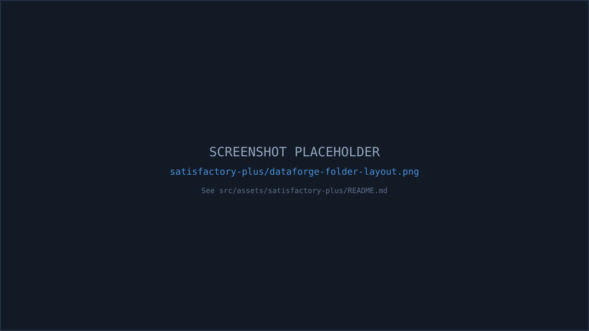

If you don't want (or don't need) to link against [KAPI](/satisfactory-plus/kapi/) directly, you can still add compatible content — new resources, miners, and other KAPI DataAssets — by shipping a **`DataForge/` folder** inside your mod with YAML packs. [KDataForge](/kdataforge/) resolves KAPI at runtime through Unreal reflection, so it works whether or not KAPI is even installed.

:::note
This page describes the general pattern any mod (Satisfactory Plus included) can use — it does not mean SF+ currently ships a `DataForge/` folder itself. The worked example below is [KDataForge's own reference sample pack](/kdataforge/getting-started/), which demonstrates exactly this pattern against real KAPI DataAsset classes.
:::

## Why this is a *soft* dependency

Unlike KAPI itself, KDataForge does **not** link against KAPI at build time:

- `KDataForge.uplugin`'s `Plugins` array lists only `SML` — no `KAPI` entry.
- None of KDataForge's four module `.Build.cs` files reference `KAPI` in `PublicDependencyModuleNames`.
- Instead, `KDFSubsystem.cpp` resolves KAPI's subsystem **by string path through Unreal reflection**, only if it's actually present:

```cpp
// KAPI is optional — resolve and invoke via reflection so no link dependency exists.
if (UClass* KAPIClass = FindObject<UClass>(nullptr, TEXT("/Script/KAPI.KAPIDataAssetSubsystem")))
{
    if (UGameInstanceSubsystem* KAPISubsystem = GameInstance->GetSubsystemBase(KAPIClass))
    {
        if (UFunction* ScanFunction = KAPISubsystem->FindFunction(FName(TEXT("StartScanForDataAssets"))))
        {
            KAPISubsystem->ProcessEvent(ScanFunction, nullptr);
        }
    }
}
```

This compiles and loads fine even with KAPI completely absent — the class lookup just returns null and the block is skipped. That's what makes it a true soft dependency rather than an optional-at-compile-time hard one.

## The folder KDataForge looks for

KDataForge's pack scanner recognizes a pack root as either:

- a directory literally named `DataForge` (canonical) or `data-editor` (legacy, still supported), or
- **any** directory that directly contains a `pack.yml` file.

It then recurses up to 6 levels deep (skipping `Content`, `Saved`, `Intermediate`, `Binaries`, `DerivedDataCache`, `Plugins`, `Source`, `Config`), and collects every `*.yml`/`*.yaml` file under that root.

So the minimal shape to add to your mod is:

```
<YourMod>/
  DataForge/
    pack.yml
    resources/
      my-resource.resource.yml
    miners/
      my-miner-tuning.cdo.yml
```

`pack.yml` is the manifest:

```yaml
ref: MyModSample
name: My Mod — Sample Pack
version: 1.0.0
priority: 100
enabled: true
```

## Worked example: adding a resource

Creating a brand-new raw resource (here, a fluid) is a `type: resource` document:

```yaml
type: resource
resources:
  - id: MoltenSuperAlloy
    parent: /Game/FactoryGame/Resource/RawResources/Water/Desc_Water.Desc_Water_C
    properties:
      - path: mDisplayName
        value: { key: MoltenSuperAlloy_Name, ns: KDFSample, source: Molten Super Alloy }
      - path: mForm
        value: RF_LIQUID
      - path: mFluidColor
        value: '(R=255,G=120,B=20,A=255)'
```

## Worked example: tuning an existing KAPI miner

To bulk-adjust an existing KAPI-driven miner DataAsset (rather than create a new one), use a `type: cdo` patch with a `conditions.hasMod` guard so the pack is a no-op when KAPI isn't installed:

```yaml
type: cdo
conditions: { hasMod: KAPI }
patches:
  - allAssetsOfClass: /Script/KAPI.KAPIModularMinerDescription
    properties:
      - path: mNormalFluidCountPerSecond
        op: multiply
        value: 1.25
```

## Worked example: creating a new KAPI DataAsset instance

To create a genuinely new KAPI DataAsset instance (not just tune an existing one) — for example a new cleaner recipe — use `type: dataasset`, again guarded by `conditions.hasMod`:

```yaml
type: dataasset
conditions: { hasMod: KAPI }
assets:
  - id: CleanerItem_SuperIngot
    class: /Script/KAPI.KAPICleanerItemDescription
    properties:
      - path: mProductionTime
        value: 6.0
      - path: mInFluid
        value: { ItemClass: /Game/.../Desc_Water.Desc_Water_C, Amount: 500 }
```

This creates a real `UPrimaryDataAsset` instance at runtime (package `/KDataForge/GenAssets/<PackRef>`, named `Gen_<PackRef>_<Id>`) and registers it with the Asset Registry — which is exactly what [KAPI's own scanning subsystem](/satisfactory-plus/kapi/#how-the-game-finds-these-assets) picks up on the next scan. `dataasset` documents only *create* instances; to edit an *existing* KAPI DataAsset instance (like a shipped miner description), use the `type: cdo` pattern shown above instead.

:::caution
KAPI intentionally crashes if certain required fields on its DataAssets are left null (for example `mResourceClass` on a miner description) — don't leave required properties unset when patching or creating KAPI assets.
:::

## Where to go next

- [KDataForge → Getting Started](/kdataforge/getting-started/) for the full first-pack walkthrough.
- [KDataForge → Data Assets](/kdataforge/features/data-assets/) for the complete `dataasset`/`cdo` reference against KAPI's DataAsset classes.
- [KDataForge → Resources](/kdataforge/features/resources/) for the full `type: resource` reference.

## Summary

| | |
|---|---|
| Dependency type | Soft (runtime Unreal reflection, no build-time link) |
| What it's used for | Third-party packs adding/patching KAPI content (miners, resources, ...) without C++ |
| Folder your mod ships | `DataForge/` (or any dir directly containing `pack.yml`) |
| KAPI-specific documents | `type: cdo` (patch existing) / `type: dataasset` (create new), both should guard with `conditions: { hasMod: KAPI }` |


